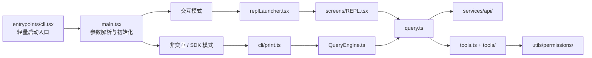

# Claude Code CLI 源码导读

> 一份面向学习与研究的 Claude Code CLI 非官方源码快照，帮助你快速定位启动流程、对话循环、工具系统、终端 UI 与扩展机制。

> [!IMPORTANT]
> 本仓库不是 Anthropic 官方仓库，也不是可直接安装或构建的 Claude Code 发行版。仓库未包含 `package.json`、锁文件、TypeScript 配置和构建/测试脚本；如需使用 Claude Code，请访问 [Claude Code 官方页面](https://claude.com/claude-code) 或 [官方 GitHub 仓库](https://github.com/anthropics/claude-code)。

## 你可以在这里研究什么

- CLI 如何完成参数解析、快速启动与交互模式初始化
- 一轮对话如何进入查询循环，并在模型响应与工具执行之间流转
- Bash、文件读写、搜索、任务等工具如何注册、过滤和执行
- 权限规则、沙箱、Hooks 与 MCP（Model Context Protocol）如何接入调用链
- 基于 React 与 Ink 的终端界面如何组织状态、输入和流式输出
- 斜杠命令、Skills、Plugins 与多代理任务如何扩展主程序

当前快照共包含 **1,902 个 TypeScript / TSX / JavaScript 文件**：1,332 个 `.ts`、552 个 `.tsx` 和 18 个 `.js`。这些数字用于描述当前提交的规模，后续更新可能发生变化。

## 架构速览

下面的图是推荐的源码阅读路线，不代表所有运行时分支：



## 核心模块地图

| 领域 | 推荐入口 | 重点内容 |
| --- | --- | --- |
| 启动与参数解析 | [`entrypoints/cli.tsx`](entrypoints/cli.tsx)、[`main.tsx`](main.tsx) | 快速路径、Commander 参数解析、运行模式分流与初始化 |
| 交互式终端 UI | [`replLauncher.tsx`](replLauncher.tsx)、[`screens/REPL.tsx`](screens/REPL.tsx) | React/Ink 组件树、输入处理、流式消息与会话交互 |
| 查询生命周期 | [`QueryEngine.ts`](QueryEngine.ts)、[`query.ts`](query.ts) | 非交互查询编排、消息循环、模型调用与工具结果回传 |
| 工具系统 | [`Tool.ts`](Tool.ts)、[`tools.ts`](tools.ts)、[`tools/`](tools/) | 工具接口、内置工具注册、模式过滤与工具池组装 |
| 斜杠命令 | [`commands.ts`](commands.ts)、[`commands/`](commands/) | 内置命令注册、可用性判断、动态命令与命令查找 |
| 权限与沙箱 | [`utils/permissions/`](utils/permissions/)、[`utils/sandbox/`](utils/sandbox/) | 权限规则、允许/拒绝决策、危险操作防护与隔离执行 |
| MCP 与扩展 | [`services/mcp/`](services/mcp/)、[`skills/`](skills/)、[`utils/plugins/`](utils/plugins/) | MCP 连接、Skills 加载、插件发现与市场安装流程 |
| 状态与上下文 | [`state/`](state/)、[`context/`](context/)、[`bootstrap/`](bootstrap/) | 应用状态、React Context、会话级共享数据与启动状态 |
| 任务与多代理 | [`Task.ts`](Task.ts)、[`tasks/`](tasks/)、[`tools/AgentTool/`](tools/AgentTool/) | 任务模型、后台任务、代理工具与协作机制 |

## 推荐阅读顺序

### 1. 从 CLI 启动开始

先看 [`entrypoints/cli.tsx`](entrypoints/cli.tsx) 中的轻量入口，再进入 [`main.tsx`](main.tsx) 的 `main()`。这里可以看到程序如何处理快速参数、初始化环境，并在不同运行模式之间分流。

### 2. 跟踪一轮完整对话

- 交互模式：[`screens/REPL.tsx`](screens/REPL.tsx) → [`query.ts`](query.ts)
- 非交互模式：[`cli/print.ts`](cli/print.ts) → [`QueryEngine.ts`](QueryEngine.ts) → [`query.ts`](query.ts)

[`QueryEngine.ts`](QueryEngine.ts) 负责非交互/SDK 路径中的查询生命周期和会话状态；交互式 REPL 则直接调用查询循环。两条路径最终都能帮助你理解消息、模型响应和工具执行如何衔接。

### 3. 理解工具如何工作

从 [`Tool.ts`](Tool.ts) 了解工具抽象，再查看 [`tools.ts`](tools.ts) 中的注册、过滤与组装逻辑。随后选择一个具体工具深入阅读，例如：

- [`tools/BashTool/`](tools/BashTool/)：Shell 命令执行与安全控制
- [`tools/FileReadTool/`](tools/FileReadTool/)：文件读取
- [`tools/FileEditTool/`](tools/FileEditTool/)：文件编辑
- [`tools/GrepTool/`](tools/GrepTool/) 与 [`tools/GlobTool/`](tools/GlobTool/)：代码搜索与文件匹配
- [`tools/AgentTool/`](tools/AgentTool/)：代理任务调度

建议同时阅读 [`utils/permissions/permissions.ts`](utils/permissions/permissions.ts)，观察工具调用如何经过权限与沙箱判断。

### 4. 研究命令与扩展机制

[`commands.ts`](commands.ts) 是斜杠命令的注册中心。Skills、Plugins 和 MCP 的入口分别集中在：

- [`skills/loadSkillsDir.ts`](skills/loadSkillsDir.ts)
- [`services/plugins/PluginInstallationManager.ts`](services/plugins/PluginInstallationManager.ts)
- [`services/mcp/MCPConnectionManager.tsx`](services/mcp/MCPConnectionManager.tsx)

## 仓库结构

```text
.
├── entrypoints/       # CLI、SDK 与沙箱相关入口
├── cli/               # 非交互输出、传输与 CLI 辅助逻辑
├── commands/          # 斜杠命令实现
├── components/        # React / Ink 终端 UI 组件
├── screens/           # REPL、诊断、会话恢复等主界面
├── tools/             # 内置工具实现
├── services/          # API、MCP、插件、分析与会话服务
├── skills/            # 内置 Skill 与加载逻辑
├── hooks/             # React Hooks
├── state/             # 应用状态管理
├── context/           # React Context 与共享上下文
├── utils/             # 权限、沙箱、配置、模型等通用模块
├── ink/               # 终端渲染辅助实现
├── main.tsx           # 主程序初始化与运行模式分流
├── QueryEngine.ts     # 非交互 / SDK 查询编排
├── query.ts           # 核心消息与工具调用循环
├── commands.ts        # 命令注册中心
└── tools.ts           # 工具注册与组装中心
```

## 如何阅读这份源码

克隆仓库后，建议使用支持 TypeScript 跳转与引用查找的编辑器：

```bash
git clone https://github.com/Nanqipro/claude-code-cli.git
cd claude-code-cli
```

如果本地安装了 [ripgrep](https://github.com/BurntSushi/ripgrep)，可以从几个关键符号开始检索：

```bash
rg "export async function main" entrypoints main.tsx
rg "export class QueryEngine" QueryEngine.ts
rg "export function getAllBaseTools" tools.ts
rg "const COMMANDS" commands.ts
```

这个仓库更适合使用“符号跳转 + 全局搜索 + 调用链回溯”的方式阅读，而不是尝试直接运行。

## 已知限制

- 缺少依赖清单、锁文件、编译配置、构建脚本与测试套件，无法据此复现官方构建。
- 源码使用 `bun:bundle`、构建期宏和功能开关；不同构建目标中的实际功能可能不同。
- 部分文件保留了生成或转译后的结构、内联 source map 和不统一的格式，阅读体验并不等同于原始工程源码。
- 仓库中的命令、工具和实验性分支不代表任一公开版本均已启用。
- 仓库当前没有顶层许可证文件；请勿据此推断代码已按开源许可证授权使用或再分发。

## 参与完善

欢迎通过 Issue 或 Pull Request 补充调用链说明、模块索引和经验证的阅读笔记。提交内容时请：

1. 明确对应的文件与符号；
2. 区分源码事实与个人推断；
3. 不提交密钥、账户信息、内部数据或其他敏感内容；
4. 不把实验性或条件编译功能描述为默认可用功能。

## 免责声明

Claude、Claude Code 与 Anthropic 是其各自权利人的产品、名称或商标。本仓库为非官方学习资料，与 Anthropic 不存在隶属、授权或背书关系。代码权利及使用条件以相关权利人的声明为准；本 README 不构成额外许可。
